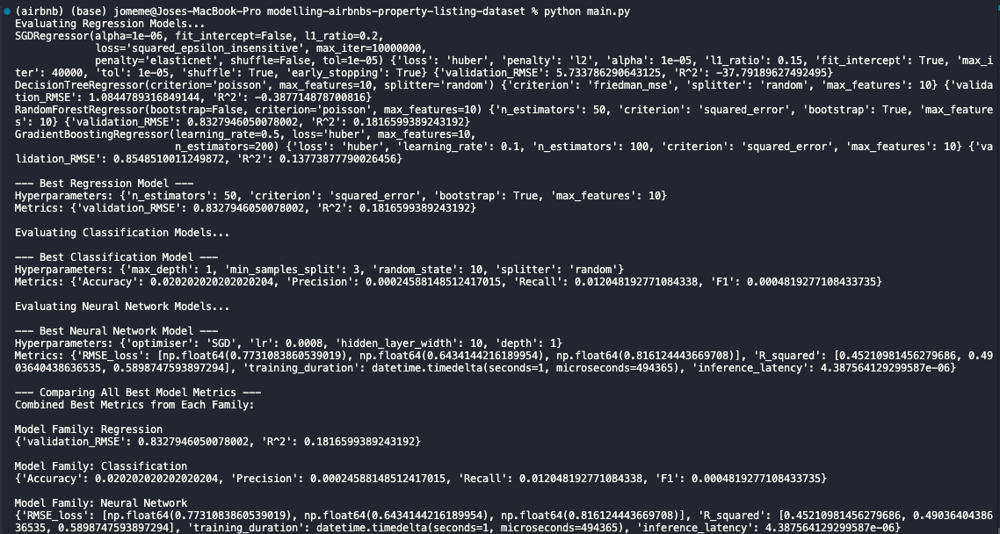

# Modelling Airbnb's Property Listing Dataset

    
    

    
<i>Results on terminal after running main.py and clickable link to YT for project overview.</i>

## Table of Contents
- [Modelling Airbnb's Property Listing Dataset](#modelling-airbnbs-property-listing-dataset)
  - [Table of Contents](#table-of-contents)
  - [Description](#description)
  - [Installation](#installation)
  - [Usage](#usage)
  - [Project Structure](#project-structure)
  - [Regression Modelling](#regression-modelling)
  - [Classification Modelling](#classification-modelling)
  - [Neural Network Modelling](#neural-network-modelling)
  - [Hyperparameter Tuning](#hyperparameter-tuning)
  - [Model Evaluation](#model-evaluation)
  - [License](#license)
    - [1. **Regression Results**](#1-regression-results)
    - [2. **Classification Results**](#2-classification-results)
    - [3. **Neural Network Results**](#3-neural-network-results)
  - [**Overall Thoughts \& Next Steps**](#overall-thoughts--next-steps)
    - [Recommendations](#recommendations)

## Description
This project aims to build a comprehensive framework for modelling Airbnb's property listing dataset. The primary objectives include data preprocessing, <b>training machine learning models for regression and classification</b> tasks, hyperparameter tuning, model evaluation, and deployment. The project <b>also focuses</b> on utilizing PyTorch <b>for neural network modelling</b> and integration of TensorBoard for visualization.

The ultimate aim of this project is to gain insights into the factors affecting property prices on Airbnb and to develop predictive models that can assist hosts in setting competitive prices and improve the overall user experience for guests.

Through this project, I learned about various aspects of data science and machine learning pipeline, including data cleaning, feature engineering, model selection, hyperparameter tuning, and model evaluation. Additionally, working with PyTorch provided valuable experience in building neural network architectures and optimizing model performance.

## Installation
To get started with the project, follow these steps:
1. Clone the repository: `git clone <repository_url>`
2. Navigate to the project directory: `cd modelling-airbnb`
3. Install the required dependencies: `pip install -r requirements.txt`

## Usage
After installing the dependencies, follow these instructions to run the project:
1. Data Preprocessing:
   - Run `python tabular_data.py` to preprocess the tabular dataset.
   - Execute `python modelling.py` to train and evaluate regression and classification models.
2. Neural Network Modelling:
   - Set up configurations in `nn_config.yaml`.
   - Run `python modelling.py` to train and evaluate PyTorch neural network models.
3. Visualization:
   - Start TensorBoard server using `tensorboard --logdir=logs` to visualize training curves and model performance.

## Project Structure
The project directory is organized as follows:
- **tabular_data.py**: Contains functions for data preprocessing and cleaning.
- **modelling.py**: Includes code for training, tuning, and evaluating machine learning models.
- **neural_networks/**: Directory for PyTorch neural network models.
- **models/**: Directory to save trained models, hyperparameters, and metrics.
- **logs/**: Directory to store TensorBoard logs.
- **README.md**: Overview of the project, instructions, and project structure.

## Regression Modelling
In the regression modelling phase, various regression models such as linear regression, decision trees, random forests, and gradient boosting are trained using sklearn. Hyperparameters for each model are fine-tuned using custom hyperparameter tuning functions and sklearn's GridSearchCV. Model performance is evaluated using key metrics such as RMSE and R^2 scores on both training and test sets.

## Classification Modelling
For classification modelling, logistic regression, decision trees, random forests, and gradient boosting classifiers are trained using sklearn. Similar to regression modelling, hyperparameters are fine-tuned, and model performance is evaluated using metrics such as F1 score, precision, recall, and accuracy.

## Neural Network Modelling
PyTorch is used for building and training neural network models. The architecture of the neural network is defined based on configurations specified in `nn_config.yaml`. Training and validation sets are used to train the model, and performance is evaluated using RMSE loss, R^2 score, and training duration.

## Hyperparameter Tuning
Hyperparameter tuning is a crucial step in model development to optimize model performance. Custom hyperparameter tuning functions are implemented for regression and classification models, which perform grid search over a range of hyperparameter values. Additionally, sklearn's GridSearchCV is utilized for fine-tuning hyperparameters.

## Model Evaluation
Model evaluation involves assessing the performance of trained models using various metrics specific to the task at hand. For regression tasks, metrics such as RMSE and R^2 score are computed, while for classification tasks, metrics like F1 score, precision, recall, and accuracy are calculated. The performance of each model is evaluated on both training and test datasets to ensure robustness and generalization.

## License
This project is licensed under the MIT License - see the [LICENSE](LICENSE) file for details.

---

Based on the printed results, **all three modeling pipelines (regression, classification, neural net)** are training and returning some best‐found models, but the actual metrics suggest that performance is rather poor—especially for the classification and neural‐network parts.

---

### 1. **Regression Results** 
- **Best Regression Model**: 
  - Looks like a RandomForest with `n_estimators=50, criterion='squared_error', bootstrap=True, max_features=10`
  - **Validation RMSE** \(\approx 0.83\) and **\( R^2 \approx 0.18 \)**
  
  An \( R^2 \) of 0.18 isn’t very strong—suggesting the model only explains about 18% of the variance in the target. This can be acceptable (depending on how noisy the data is) or it might indicate **more feature engineering**, **more hyperparameter tuning**, or different approaches (e.g., ensembles, deeper hyperparameter search, more data) might be needed.  

---

### 2. **Classification Results**  
- **Best Classification Model**: 
  - A Decision Tree with `max_depth=1`, `min_samples_split=3`, `random_state=10`, `splitter='random'`
  - **Accuracy** \(\approx 0.02\), **Precision** \(\approx 0.00025\), **Recall \(\approx 0.012\)**, **F1** \(\approx 0.00048\)**

These numbers are extremely low (almost random-chance or worse). That usually signals:
1. **Target Imbalance**: Possibly the label distribution is skewed (e.g., 99% of the samples are in one class).
2. **Data/Label Mismatch**: Are you sure the target column is correct? 
3. **Feature Quality**: Maybe the features have little signal or are not relevant for classification.
4. **Splitting / Label** issues: Possibly an error in how the data is split or how the targets are generated.

**Try**:
- Checking how many classes you have, and how many examples per class.  
- Trying a simpler “baseline” (like predicting the most frequent class) to see if 2% accuracy is *even worse* than the baseline.  
- Confirm the `y` label is the correct classification target.

---

### 3. **Neural Network Results** 
- The best hyperparameters found: **`optimiser='SGD', lr=1e-05, hidden_layer_width=16, depth=1`**
- The \( R^2 \) array for Train/Val/Test is \([-0.0382,\ 0.1215,\ -0.0058]\) (approx). 

This is quite low or even negative for train/test, which means the model is doing worse than a naïve “predict the mean” baseline in some splits. Generally:
1. **Tiny Learning Rate** (1e-5) is extremely small for a dataset that presumably isn’t huge. It might not be learning much in just 40 epochs.
2. **Network Depth** & **Epoch Count** might need to be larger. 
3. Possibly the data scale or transformations are an issue, or the “Box-Cox” transformations you’ve done in `regression.py` weren’t also applied for the NN.

**Try**:
- Training with a bigger learning rate (e.g., 1e-3 or 5e-4).
- Let the model train for more epochs (e.g., 100 or 200) to ensure it converges.
- Verify that the NN sees the same exact preprocessed data as your regression pipeline.
- Possibly experiment with better network structures and multiple hidden layers.

---

## **Overall Thoughts & Next Steps**

- **Regression**: an \(R^2\approx0.18\) indicates there’s probably room for improvement, but it’s at least performing better than random.  
- **Classification** at ~2% accuracy is *very suspicious.* That’s usually a sign of either mislabeled data or an extremely imbalanced target. Investigate the distribution of `y` and confirm you’re actually solving the intended classification task.  
- **Neural Network** results reflect that it’s not learning effectively. Possibly the data or the training hyperparameters are suboptimal.  

### Recommendations
1. **Double-check** your **data loading** and **target** columns (especially classification). Make sure the labels are correct, are not heavily imbalanced, or if they are, handle them (e.g., class weighting, oversampling, or focusing on metrics that account for imbalance).
2. **Increase training epochs** and/or use **more suitable learning rates** for the neural network.  
3. **Compare** how each pipeline’s data is being preprocessed. If you do transformations (e.g., Box-Cox) in the regression pipeline, you might want to do the same for the neural network.  
4. **Evaluate** if additional feature engineering or a more exhaustive hyperparameter search (particularly for classification) might help.  

These steps should help move you toward more realistic metrics if the data genuinely has signal for these tasks.